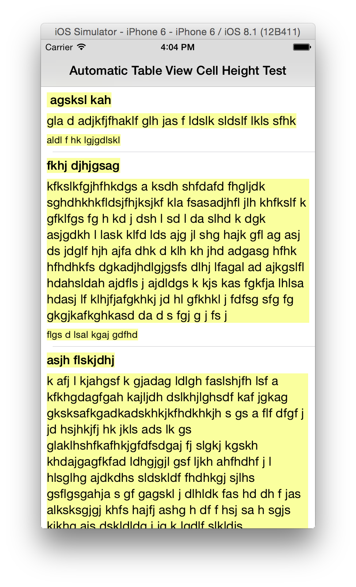

# Automatic Table View Cell Height
You can use this project to observe iOS 8's `UITableViewAutomaticDimension` behavior. The project has three random length labels in each Cell which pull or push the size of the cell itself.

